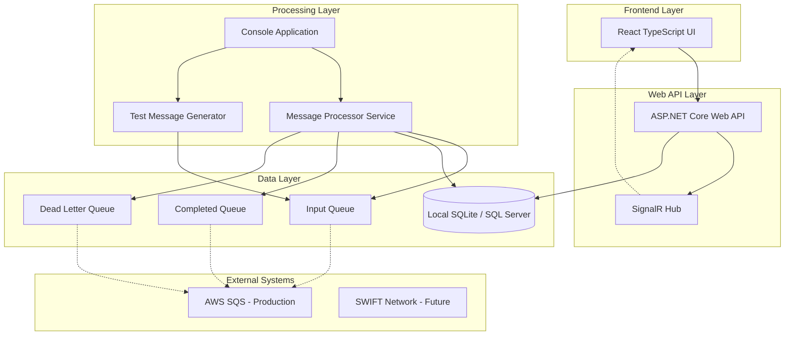
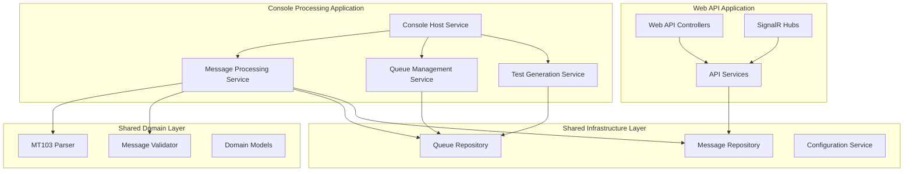

# Design Document

## Overview

The SWIFT Message Processing System is designed as a distributed application with a TypeScript React frontend and a .NET Core 9.0 backend. The system processes MT103 SWIFT messages through a queue-based architecture, stores processed data in a database, and provides a web interface for monitoring and management. The design emphasizes modularity, extensibility, and environment flexibility to support both local development and production deployment.

## Architecture

### High-Level Architecture



### Component Architecture

The system follows a distributed architecture with clear separation between API and processing concerns:



## Components and Interfaces

### Console Application Architecture

The console application serves as the dedicated processing engine, running as a separate service from the Web API:

#### Console Host Service
```csharp
public class ConsoleHostService : BackgroundService
{
    private readonly IMessageProcessingService _messageProcessor;
    private readonly ITestGeneratorService _testGenerator;
    private readonly ILogger<ConsoleHostService> _logger;
    
    protected override async Task ExecuteAsync(CancellationToken stoppingToken)
    {
        // Start background message processing
        // Handle graceful shutdown
        // Manage service lifecycle
    }
}
```

#### Process Communication

The Web API and Console Application communicate through multiple channels:

**Database Communication**
- Shared database for message storage and status updates
- Console app writes processing results, Web API reads for display
- Database triggers or polling for real-time status updates

**File-based Communication** (Development)
```csharp
public interface IProcessCommunicationService
{
    Task SendCommandAsync(ProcessCommand command);
    Task<ProcessStatus> GetStatusAsync();
    Task<bool> IsConsoleAppHealthyAsync();
}

public class FileBasedCommunicationService : IProcessCommunicationService
{
    // Implementation using shared file system for commands and status
}
```

**Named Pipes Communication** (Production)
```csharp
public class NamedPipeCommunicationService : IProcessCommunicationService
{
    // Implementation using named pipes for inter-process communication
}
```

**Configuration and Logging**
- Shared configuration files for consistent behavior
- Centralized logging for monitoring both applications
- Health check endpoints in both applications

### Frontend Components

#### Dashboard Component
- **Purpose**: Main interface for viewing message statistics and system status
- **Key Features**: Real-time updates via SignalR, status filtering, search functionality
- **State Management**: React Context API for global state, local state for component-specific data

#### Message List Component
- **Purpose**: Display paginated list of processed messages
- **Key Features**: Sorting, filtering, detailed view modal
- **Performance**: Virtual scrolling for large datasets, debounced search

#### System Control Component
- **Purpose**: Administrative controls for processor management
- **Key Features**: Start/stop processor, view system health, configuration management

### Backend Services

#### IMessageProcessingService (Console Application)
```csharp
public interface IMessageProcessingService
{
    Task<ProcessingResult> ProcessMessageAsync(string rawMessage);
    Task StartProcessingAsync(CancellationToken cancellationToken);
    Task StopProcessingAsync();
    Task<SystemStatus> GetSystemStatusAsync();
}
```

#### IApiService (Web API Application)
```csharp
public interface IApiService
{
    Task<IEnumerable<ProcessedMessage>> GetMessagesAsync(MessageFilter filter);
    Task<ProcessedMessage> GetMessageByIdAsync(Guid messageId);
    Task<SystemStatus> GetSystemStatusAsync();
    Task<bool> RestartProcessorAsync();
}
```

#### ISwiftMessageParser
```csharp
public interface ISwiftMessageParser<T> where T : SwiftMessage
{
    Task<T> ParseAsync(string rawMessage);
    Task<ValidationResult> ValidateAsync(T message);
    bool CanParse(string messageType);
}
```

#### IQueueService
```csharp
public interface IQueueService
{
    Task<string> ReceiveMessageAsync(string queueName);
    Task SendMessageAsync(string queueName, string message);
    Task<bool> IsHealthyAsync();
    Task<QueueStatistics> GetStatisticsAsync();
}
```

#### IMessageRepository
```csharp
public interface IMessageRepository
{
    Task<Guid> SaveMessageAsync(ProcessedMessage message);
    Task<ProcessedMessage> GetByIdAsync(Guid id);
    Task<IEnumerable<ProcessedMessage>> GetByFilterAsync(MessageFilter filter);
    Task UpdateStatusAsync(Guid id, MessageStatus status);
}
```

## Data Models

### Core Domain Models

#### SwiftMessage (Base Class)
```csharp
public abstract class SwiftMessage
{
    public string MessageType { get; set; }
    public string RawMessage { get; set; }
    public DateTime ReceivedAt { get; set; }
    public Dictionary<string, string> Fields { get; set; }
    
    public abstract ValidationResult Validate();
}
```

#### MT103Message
```csharp
public class MT103Message : SwiftMessage
{
    // Mandatory Fields
    public string TransactionReference { get; set; } // Field 20
    public string BankOperationCode { get; set; } // Field 23B
    public DateTime ValueDate { get; set; } // Field 32A
    public string Currency { get; set; } // Field 32A
    public decimal Amount { get; set; } // Field 32A
    public OrderingCustomer OrderingCustomer { get; set; } // Field 50A/K
    public BeneficiaryCustomer BeneficiaryCustomer { get; set; } // Field 59
    
    // Optional Fields
    public string OriginalCurrency { get; set; } // Field 33B
    public decimal? OriginalAmount { get; set; } // Field 33B
    public string OrderingInstitution { get; set; } // Field 52A
    public string SendersCorrespondent { get; set; } // Field 53B
    public string IntermediaryInstitution { get; set; } // Field 56A
    public string AccountWithInstitution { get; set; } // Field 57A
    public string RemittanceInformation { get; set; } // Field 70
    public ChargeDetails ChargeDetails { get; set; } // Field 71A
    public string SenderToReceiverInfo { get; set; } // Field 72
}
```

#### ProcessedMessage
```csharp
public class ProcessedMessage
{
    public Guid Id { get; set; }
    public string MessageType { get; set; }
    public string RawMessage { get; set; }
    public SwiftMessage ParsedMessage { get; set; }
    public MessageStatus Status { get; set; }
    public DateTime ProcessedAt { get; set; }
    public string ErrorDetails { get; set; }
    public Dictionary<string, object> Metadata { get; set; }
}
```

### Database Schema

#### Messages Table
```sql
CREATE TABLE Messages (
    Id UNIQUEIDENTIFIER PRIMARY KEY,
    MessageType NVARCHAR(10) NOT NULL,
    RawMessage NTEXT NOT NULL,
    ParsedData NTEXT, -- JSON serialized parsed message
    Status INT NOT NULL,
    ProcessedAt DATETIME2 NOT NULL,
    ErrorDetails NTEXT,
    Metadata NTEXT, -- JSON serialized metadata
    CreatedAt DATETIME2 DEFAULT GETUTCDATE(),
    UpdatedAt DATETIME2 DEFAULT GETUTCDATE()
);

CREATE INDEX IX_Messages_Status ON Messages(Status);
CREATE INDEX IX_Messages_MessageType ON Messages(MessageType);
CREATE INDEX IX_Messages_ProcessedAt ON Messages(ProcessedAt);
```

#### System Audit Table
```sql
CREATE TABLE SystemAudit (
    Id UNIQUEIDENTIFIER PRIMARY KEY,
    EventType NVARCHAR(50) NOT NULL,
    EventData NTEXT,
    Timestamp DATETIME2 DEFAULT GETUTCDATE(),
    UserId NVARCHAR(100),
    IpAddress NVARCHAR(45)
);
```

## Error Handling

### Error Categories

1. **Parsing Errors**: Invalid SWIFT message format, missing mandatory fields
2. **Validation Errors**: Field format violations, business rule violations
3. **Infrastructure Errors**: Database connectivity, queue connectivity
4. **System Errors**: Unexpected exceptions, resource exhaustion

### Error Handling Strategy

#### Retry Mechanism
```csharp
public class RetryPolicy
{
    public int MaxRetries { get; set; } = 3;
    public TimeSpan InitialDelay { get; set; } = TimeSpan.FromSeconds(1);
    public TimeSpan MaxDelay { get; set; } = TimeSpan.FromMinutes(5);
    public double BackoffMultiplier { get; set; } = 2.0;
}
```

#### Dead Letter Queue Processing
- Messages that fail parsing after max retries
- Messages that violate business rules
- Messages that cause system exceptions
- Detailed error information stored with each failed message

#### Circuit Breaker Pattern
- Implemented for external dependencies (database, queues)
- Automatic recovery attempts with exponential backoff
- Health check endpoints for monitoring

## Testing Strategy

### Unit Testing
- **Parser Testing**: Validate MT103 field parsing with various message formats
- **Validation Testing**: Test business rules and SWIFT compliance
- **Service Testing**: Mock dependencies and test business logic
- **Repository Testing**: In-memory database testing

### Integration Testing
- **Queue Integration**: Test with local queue implementations
- **Database Integration**: Test with SQLite for CI/CD pipeline
- **API Integration**: End-to-end API testing with test database

### Performance Testing
- **Message Throughput**: Target 1000 messages per minute processing
- **Database Performance**: Query optimization for large datasets
- **Memory Usage**: Monitor for memory leaks in long-running processes

### Test Data Generation
```csharp
public class MT103TestDataGenerator
{
    public MT103Message GenerateValidMessage();
    public MT103Message GenerateInvalidMessage(ValidationError errorType);
    public string GenerateRawMessage(MT103Message message);
    public IEnumerable<MT103Message> GenerateBatch(int count);
}
```

## Configuration Management

### Environment-Specific Configuration

#### Development Configuration
```json
{
  "Database": {
    "Provider": "SQLite",
    "ConnectionString": "Data Source=messages.db"
  },
  "Queue": {
    "Provider": "InMemory",
    "Settings": {
      "InputQueue": "input-messages",
      "CompletedQueue": "completed-messages",
      "DeadLetterQueue": "failed-messages"
    }
  },
  "TestMode": {
    "Enabled": true,
    "GenerationInterval": "00:00:10"
  }
}
```

#### Production Configuration
```json
{
  "Database": {
    "Provider": "SqlServer",
    "ConnectionString": "Server=prod-server;Database=SwiftMessages;Integrated Security=true"
  },
  "Queue": {
    "Provider": "AmazonSQS",
    "Settings": {
      "Region": "us-east-1",
      "InputQueue": "swift-input-messages",
      "CompletedQueue": "swift-completed-messages",
      "DeadLetterQueue": "swift-failed-messages"
    }
  },
  "TestMode": {
    "Enabled": false
  }
}
```

### Configuration Validation
- Startup validation of all configuration sections
- Health checks for external dependencies
- Configuration change detection and hot reload where appropriate

## Security Considerations

### Data Protection
- Encryption at rest for sensitive financial data
- Secure transmission protocols (HTTPS, TLS)
- PII masking in logs and error messages

### Access Control
- Role-based access control for administrative functions
- API key authentication for service-to-service communication
- Audit logging for all administrative actions

### Compliance
- SWIFT message format compliance validation
- Audit trail maintenance for regulatory requirements
- Data retention policies implementation

## Deployment Architecture

### Local Development
- Docker Compose for multi-service orchestration
- SQLite database for simplicity
- In-memory queues for testing
- Hot reload for development efficiency

### Staging Environment
- AWS ECS for container orchestration
- AWS RDS for managed database
- AWS SQS for message queuing
- CloudWatch for monitoring and logging

### Production Environment
- Kubernetes cluster for high availability
- SQL Server cluster for enterprise database
- AWS SQS with DLQ configuration
- Comprehensive monitoring and alerting

## Monitoring and Observability

### Metrics Collection
- Message processing rates and latencies
- Error rates by category
- System resource utilization
- Queue depth and processing lag

### Logging Strategy
- Structured logging with correlation IDs
- Different log levels for different environments
- Centralized log aggregation
- Log retention policies

### Health Checks
- Database connectivity checks
- Queue service availability
- Memory and CPU utilization
- Custom business logic health indicators